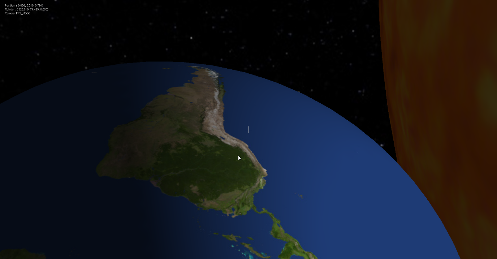
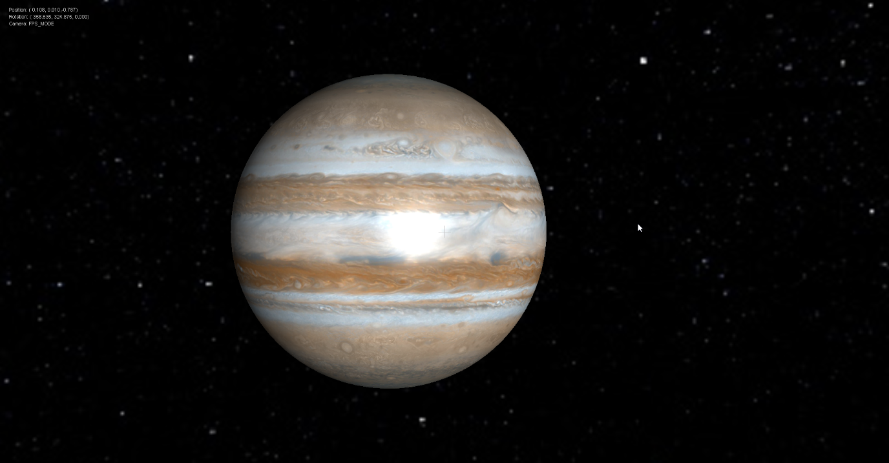
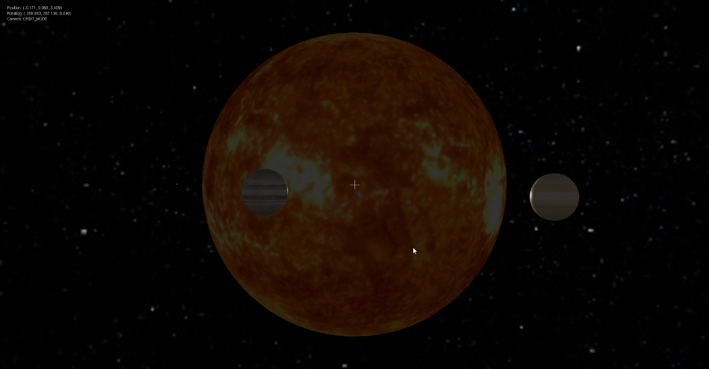
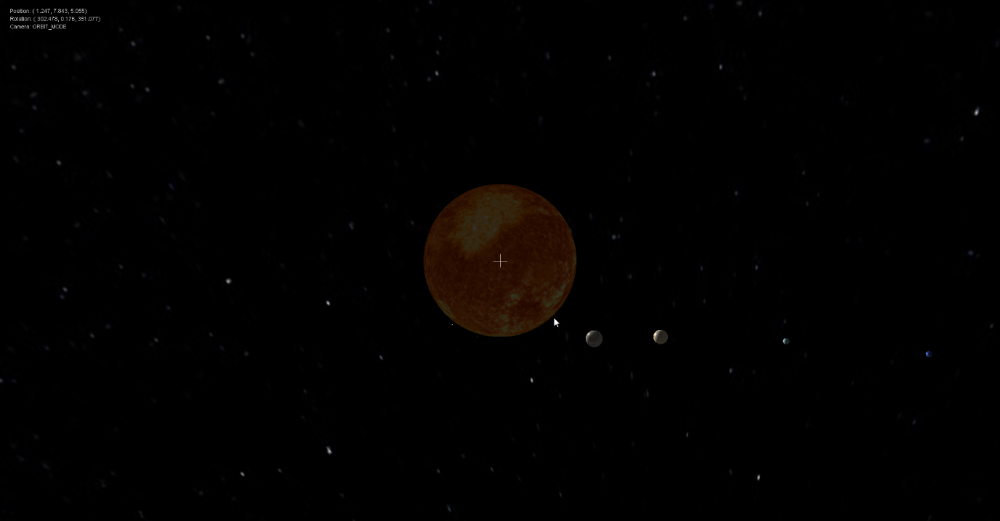

# A Scaled 3D Visualisation of the Solar System

A Java3D based interactive model of the Solar System which can be clicked, dragged and change viewpoints to see other orbiting planets.

## Sample Screenshots

